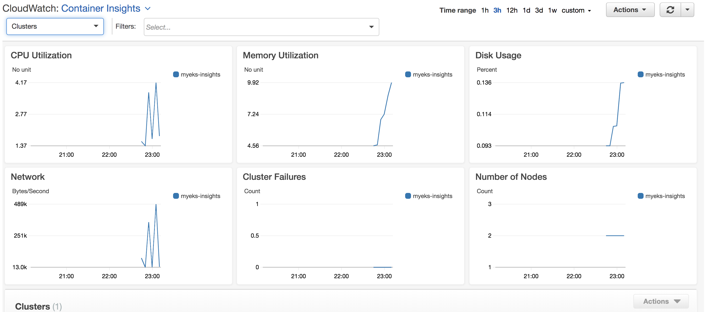
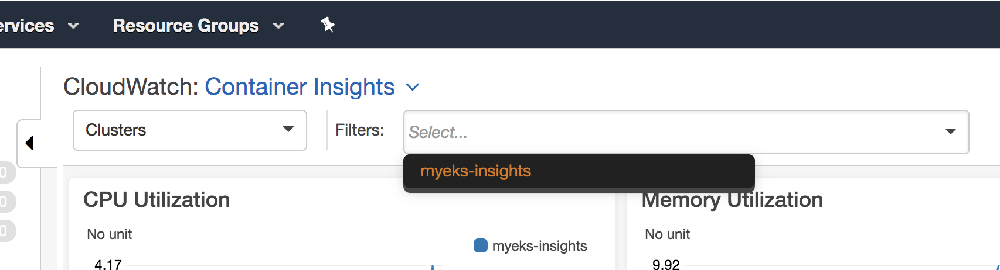
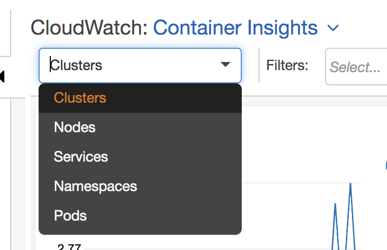
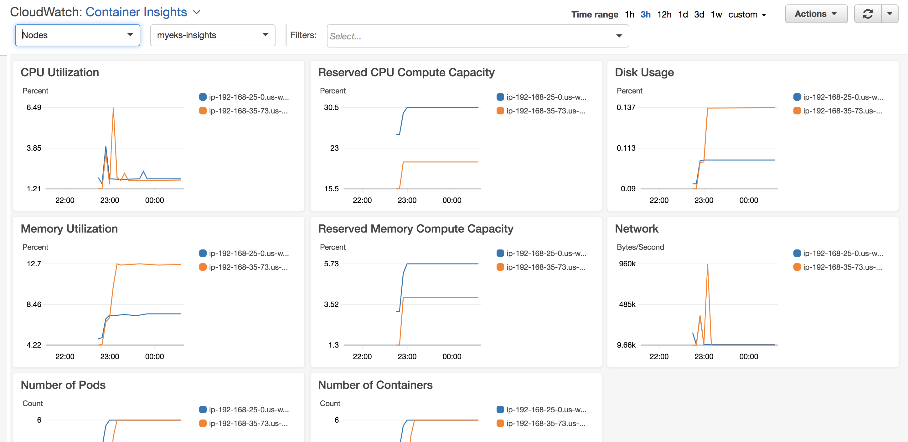
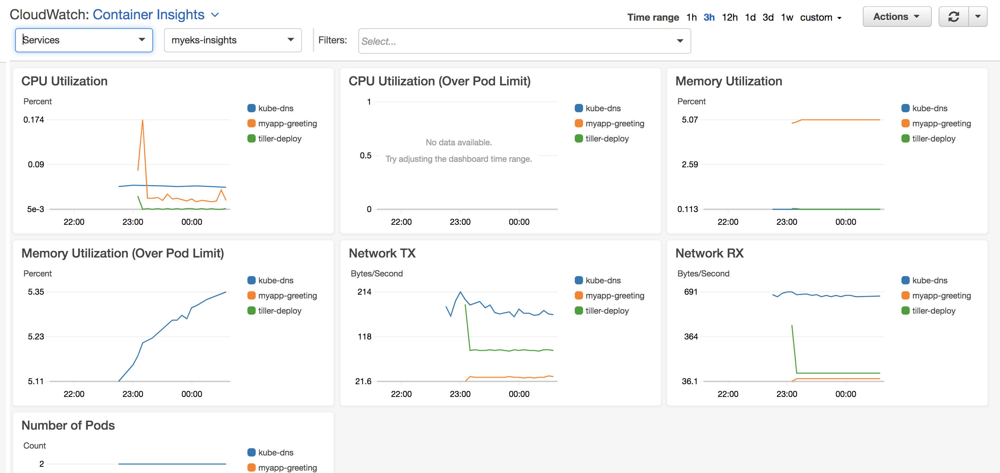
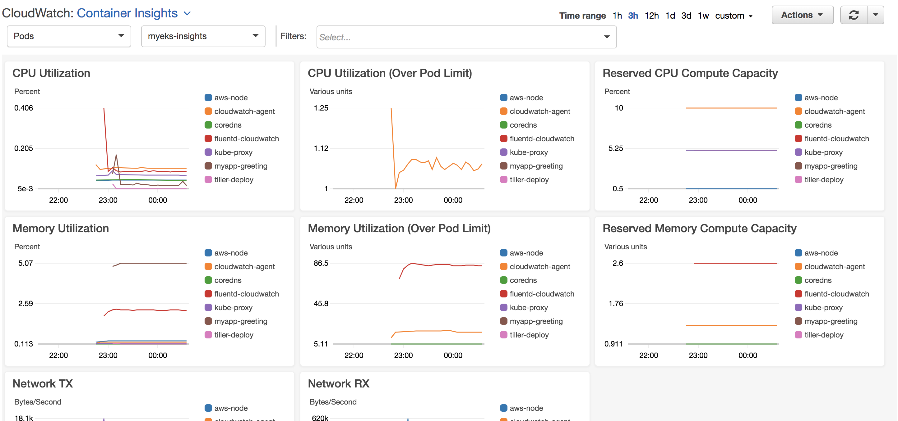

# CloudWatch Container Insights with Amazon EKS

[Container Insights](https://docs.aws.amazon.com/AmazonCloudWatch/latest/monitoring/ContainerInsights.html) collect, aggregate, and summarize metrics and logs from your containerized applications. It works for Amazon EKS and k8s on EC2. These are brief instructions on how to configure them for an EKS cluster.

## Create EKS cluster

- Check `eksctl` version:

	```
	eksctl version
	[ℹ]  version.Info{BuiltAt:"", GitCommit:"", GitTag:"0.1.36"}
	```

- Crete an EKS cluster. The cluster configuration attaches the necessary policy to the IAM role of worker nodes:

	```
	eksctl create cluster --config-file cluster.yaml
	[ℹ]  using region 
	[ℹ]  setting availability zones to [us-west-2b us-west-2a us-west-2c]
	[ℹ]  subnets for us-west-2b - public:192.168.0.0/19 private:192.168.96.0/19
	[ℹ]  subnets for us-west-2a - public:192.168.32.0/19 private:192.168.128.0/19
	[ℹ]  subnets for us-west-2c - public:192.168.64.0/19 private:192.168.160.0/19
	[ℹ]  nodegroup "ng-1" will use "ami-0f11fd98b02f12a4c" [AmazonLinux2/1.12]
	[ℹ]  using EC2 key pair "arun-us-west2"
	[ℹ]  creating EKS cluster "" in "" region
	[ℹ]  1 nodegroup (ng-1) was included
	[ℹ]  will create a CloudFormation stack for cluster itself and 1 nodegroup stack(s)
	[ℹ]  if you encounter any issues, check CloudFormation console or try 'eksctl utils describe-stacks --region= --name='
	[ℹ]  2 sequential tasks: { create cluster control plane "myeks-insights", create nodegroup "ng-1" }
	[ℹ]  building cluster stack "eksctl-myeks-insights-cluster"
	[ℹ]  deploying stack "eksctl-myeks-insights-cluster"
	[ℹ]  building nodegroup stack "eksctl-myeks-insights-nodegroup-ng-1"
	[ℹ]  --nodes-min=2 was set automatically for nodegroup ng-1
	[ℹ]  --nodes-max=2 was set automatically for nodegroup ng-1
	[ℹ]  deploying stack "eksctl-myeks-insights-nodegroup-ng-1"
	[✔]  all EKS cluster resource for "" had been created
	[✔]  saved kubeconfig as "/Users/argu/.kube/config"
	[ℹ]  adding role "arn:aws:iam::091144949931:role/eksctl-myeks-insights-nodegroup-n-NodeInstanceRole-42PNSWRXN16T" to auth ConfigMap
	[ℹ]  nodegroup "ng-1" has 1 node(s)
	[ℹ]  node "ip-192-168-25-0.us-west-2.compute.internal" is not ready
	[ℹ]  waiting for at least 2 node(s) to become ready in "ng-1"
	[ℹ]  nodegroup "ng-1" has 2 node(s)
	[ℹ]  node "ip-192-168-25-0.us-west-2.compute.internal" is ready
	[ℹ]  node "ip-192-168-35-73.us-west-2.compute.internal" is ready
	[ℹ]  kubectl command should work with "/Users/argu/.kube/config", try 'kubectl get nodes'
	[✔]  EKS cluster "" in "" region is ready
	```

## Setup CloudWatch agent to collect metrics

- Create namespace:

	```
	kubectl apply -f https://s3.amazonaws.com/cloudwatch-agent-k8s-yamls/kubernetes-monitoring/cloudwatch-namespace.yaml
	namespace/amazon-cloudwatch created
	```

- Create a service account:

	```
	kubectl apply -f https://s3.amazonaws.com/cloudwatch-agent-k8s-yamls/kubernetes-monitoring/cwagent-serviceaccount.yaml
	serviceaccount/cloudwatch-agent created
	clusterrole.rbac.authorization.k8s.io/cloudwatch-agent-role created
	clusterrolebinding.rbac.authorization.k8s.io/cloudwatch-agent-role-binding created
	```

- Download ConfigMap for CloudWatch Agent:

	```
	curl -O https://s3.amazonaws.com/cloudwatch-agent-k8s-yamls/kubernetes-monitoring/cwagent-configmap.yaml
	```

	Delete the line:

	```
	"cluster_name": "{{cluster-name}}",
	```

	Create ConfigMap:

	```
	kubectl apply -f cwagent-configmap.yaml
	```

- Deploy the agent as DaemonSet:

	```
	kubectl apply -f https://s3.amazonaws.com/cloudwatch-agent-k8s-yamls/kubernetes-monitoring/cwagent-daemonset.yaml
	daemonset.apps/cloudwatch-agent created
	```

- Validate the agent:

	```
	kubectl get pods -n amazon-cloudwatch
	NAME                     READY   STATUS    RESTARTS   AGE
	cloudwatch-agent-9hbjh   1/1     Running   0          92s
	cloudwatch-agent-c2hln   1/1     Running   0          92s
	```

## Install FluentD

- Create ConfigMap for FluentD:

	```
	kubectl create configmap cluster-info \
		--from-literal=cluster.name=myeks-insights \
		--from-literal=logs.region=us-west-2 -n amazon-cloudwatch
	configmap/cluster-info created
	```

- Deploy FluentD DaemonSet:

	```
	kubectl apply -f https://s3.amazonaws.com/cloudwatch-agent-k8s-yamls/fluentd/fluentd.yml
	serviceaccount/fluentd created
	clusterrole.rbac.authorization.k8s.io/fluentd-role created
	clusterrolebinding.rbac.authorization.k8s.io/fluentd-role-binding created
	configmap/fluentd-config created
	daemonset.extensions/fluentd-cloudwatch created
	```

- Validate:

	```
	kubectl get pods -l k8s-app=fluentd-cloudwatch -n amazon-cloudwatch 
	NAME                       READY   STATUS    RESTARTS   AGE
	fluentd-cloudwatch-98pcr   1/1     Running   0          3m38s
	fluentd-cloudwatch-rfprv   1/1     Running   0          3m38s
	```

## Deploy application

- Install Helm:

	```
	kubectl -n kube-system create sa tiller
	kubectl create clusterrolebinding tiller --clusterrole cluster-admin --serviceaccount=kube-system:tiller
	helm init --service-account tiller
	```

- Deploy a Helm chart:

	```
	git clone https://github.com/aws-samples/kubernetes-for-java-developers
	cd kubernetes-for-java-developers
	helm install --name myapp manifests/myapp
	```

- Verify application:

	```
	curl http://$(kubectl get svc/myapp-greeting \
		-o jsonpath='{.status.loadBalancer.ingress[0].hostname}')/hello
	```

## View Container Insights

- Watch Container Insights at https://us-west-2.console.aws.amazon.com/cloudwatch/home?region=us-west-2#cw:dashboard=Container

	Default view is cluster:

	

	Pick the cluster:

	

	Select the view:

	

	Nodes view:

	

	Services view:

	

	Pods view:

	


