# IntelliJ and AWS Toolkit Demo Script

## Pre-reqs

```
IntelliJ IDEA 2018.3.5 (Community Edition)
Build #IC-183.5912.21, built on February 26, 2019
JRE: 1.8.0_152-release-1343-b28 x86_64
JVM: OpenJDK 64-Bit Server VM by JetBrains s.r.o
macOS 10.13.6
```

## Install SAM CLI

Needs SAM CLI 0.13.0

```
brew install aws-sam-cli
```

or

```
brew upgrade aws-sam-cli
```

Check the version:

```
sam --version
SAM CLI, version 0.12.0
```

## Setup Plugin

- IntelliJ IDEA, `Preferences`
- Subscribe to EAP builds as explained at https://github.com/aws/aws-toolkit-jetbrains#eap-builds
- Search for `plugins`
- Search for `aws tooklkit`, select. Verify the version number is `v1.2-EAP.2019.03.14` at least and click on `Install`.
- Click on `Restart IDE` to restart the IDE

## Create New Application

- `Create New Project`, `AWS`, `AWS Serverless Application`, `Next`
- Specify the values as shown:
  
- Click on `Maven` on top-right, add on `+`, select `pom.xml`

## Create Lambda Function

- Expand project, `HelloWorldFunction`, `src`, `main`, `java`, `helloworld`
- Explain `App.java`, standard Java imports and AWS SDK
- Click on Lambda icon next to `public class`, `Create new AWS Lambda...`
  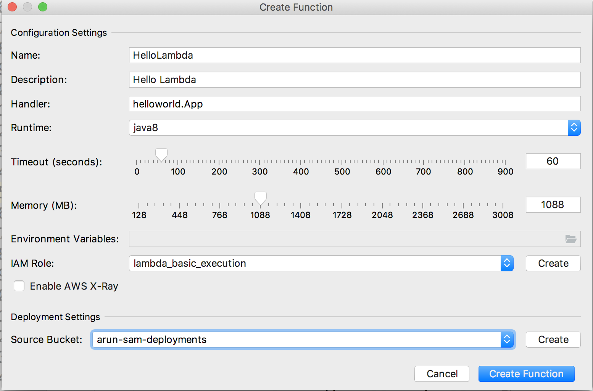
  - Change memory to 1088
  - Configure AWS connection settings, if need to
  - Pick the region `us-west-1`
- `Create Function`
- Wait for the event log on bottom right corner
  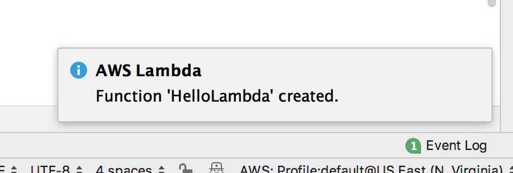
- `AWS Explorer` in bottom left corner, expand `Lambda`, refresh if need to
  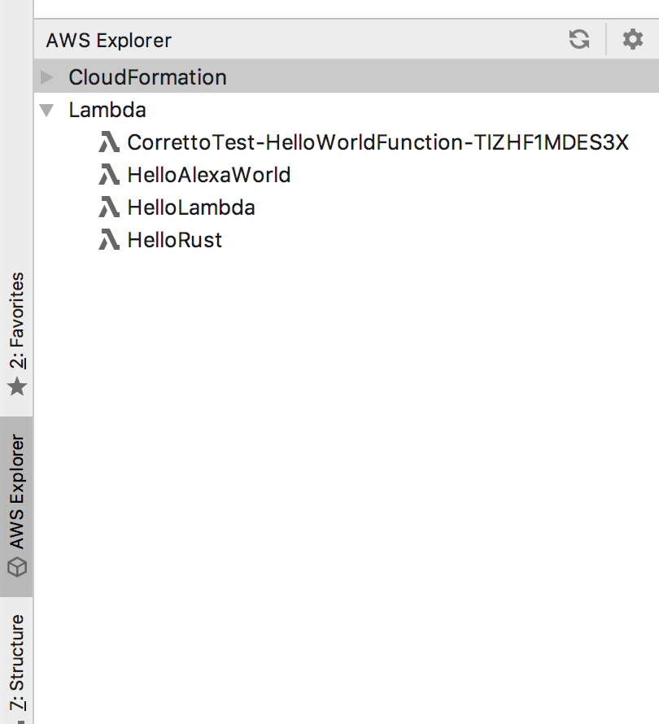
  Show the Lambda function.

## Invoke Lambda Function Locally

- Click on Lambda icon, click on `Run [Local] App`
  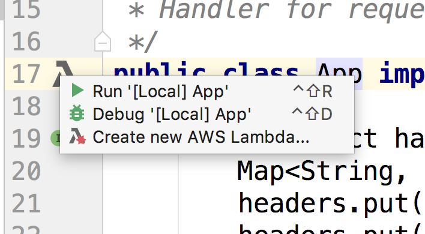
- Change the payload to `{}`
  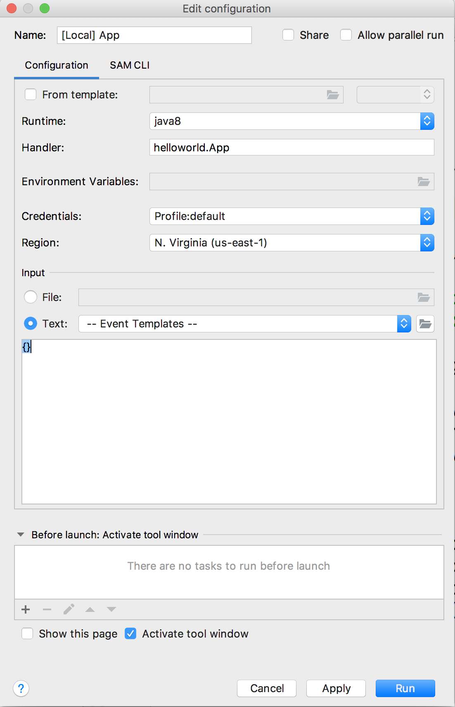
- Click on `Run` to run the function locally
  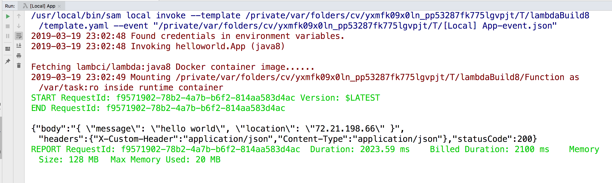

## Debug Lambda Function Locally

- Setup a breakpoint in the code
- Click on Lambda icon, click on `Debug [Local] App`
  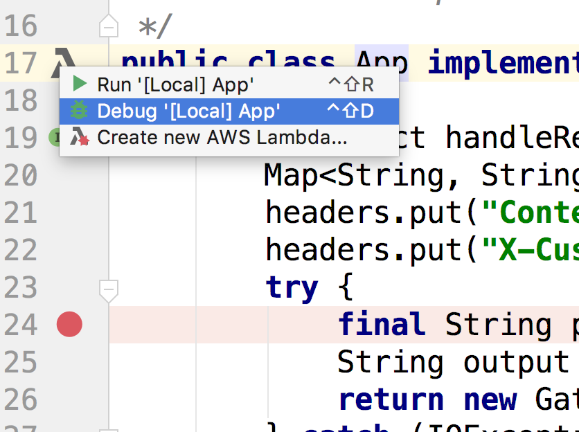
- Watch for the debugger to show frames and variables:
  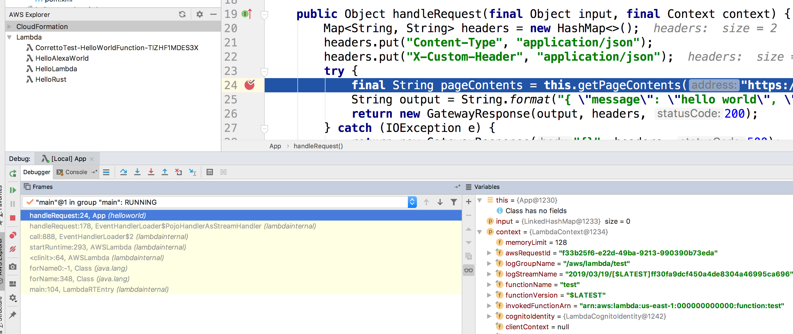
- Click on the green arrow in debugger console to resume execution, see the results:
  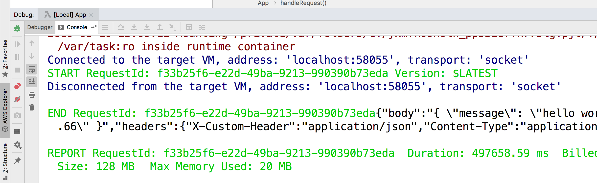

## Invoke Lambda Function Remotely

- In `AWS Explorer`, click on `Lambda`, select `Hello Lambda` function, select `Run [Remote] HelloLambda...`
  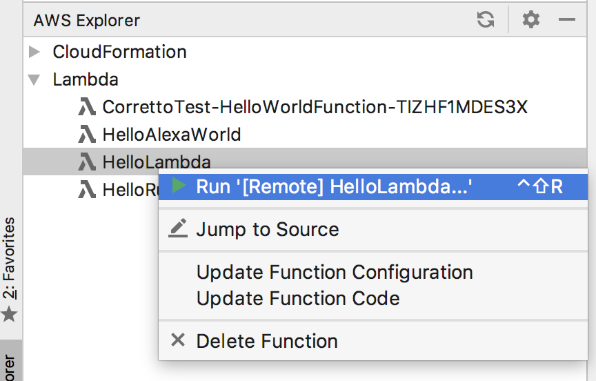
- Change the payload to `{}`
  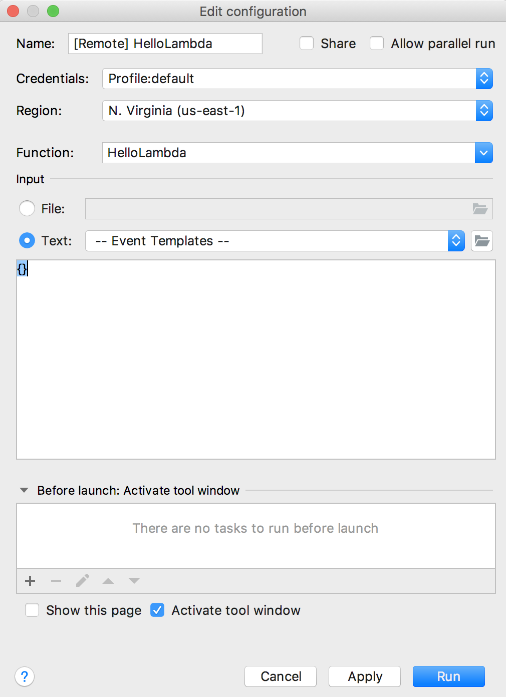
- Click on `Run`
  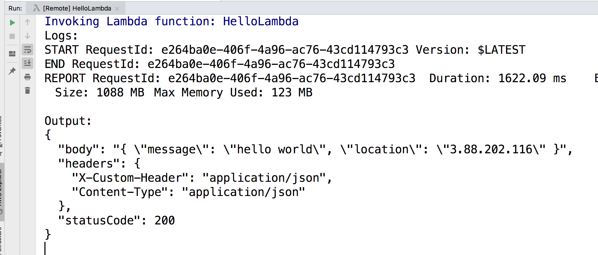

## Invoke Lambda Function Using CloudFormation

